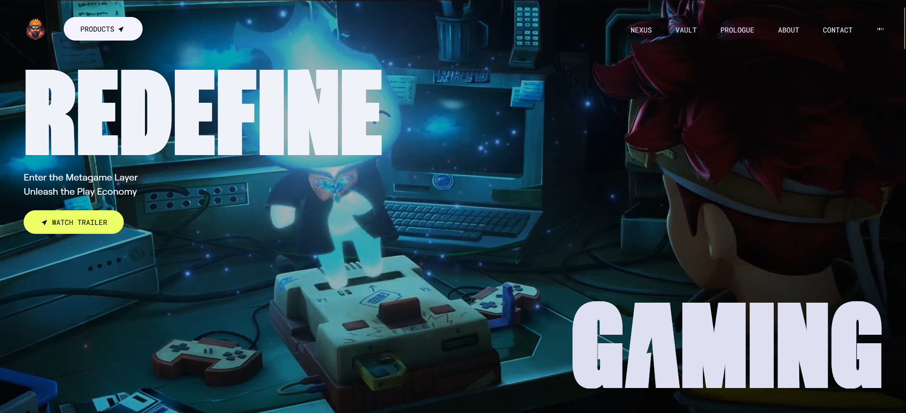
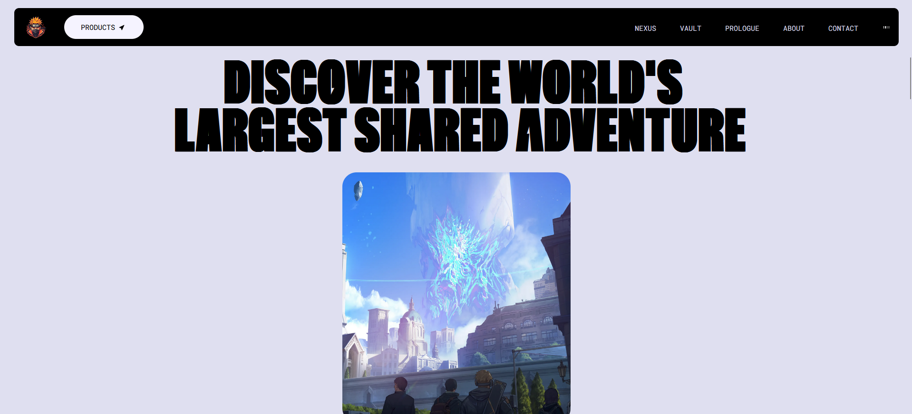
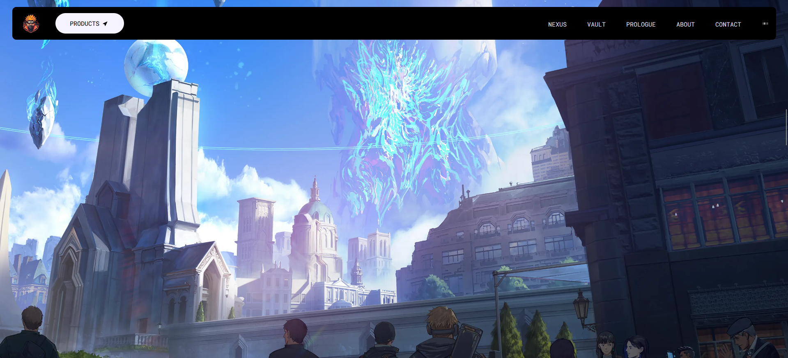

🌟 Animated Webpage

A modern, highly interactive animated webpage built with React.js, Tailwind CSS, and GSAP. This project delivers smooth animations, engaging hover effects, and an immersive user experience.

🔗 Live Demo: expert-eureka-three.vercel.app
📂 GitHub Repository: github.com/Haji-Sharifi/expert-eureka
🚀 Features

✅ React.js for a modular and efficient UI
✅ Tailwind CSS for a customizable and responsive design
✅ GSAP (GreenSock Animation Platform) for seamless animations
✅ Smooth scrolling effects
✅ Interactive animations on page load and user interactions
🛠️ Technologies Used

React.js – Frontend framework
Tailwind CSS – Utility-first styling
GSAP – High-performance animation library

📦 Installation & Setup

    Clone the repository:https://github.com/Haji-Sharifi/expert-eureka.git

git clone https://github.com/Haji-Sharifi/expert-eureka.git  
cd expert-eureka

Install dependencies:

    npm install

Start the development server:

    npm run dev

🎨 Customization

Modify components in the src folder to add custom animations.
Use Tailwind classes for styling adjustments.

📷 Screenshots

📬 Contact

For any questions or collaboration opportunities, feel free to reach out!
